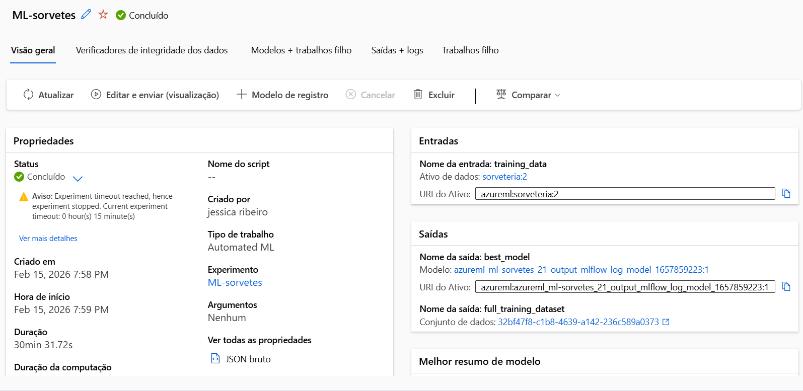

# 🍦 Projeto Gelato Mágico: Previsão de Vendas com Azure AI

## 📖 A História da Gelato Mágico
A **Gelato Mágico** nasceu do sonho da Dona Magali em trazer o verdadeiro gelato artesanal para o coração de **Varginha, MG**. O negócio cresceu, mas surgiu um desafio: como prever a quantidade de sorvete a ser produzida para evitar desperdícios em dias frios ou falta de estoque em dias de calor intenso? Este projeto utiliza Inteligência Artificial para transformar a temperatura local em previsões precisas de vendas.

---

## 🛠️ Tecnologias e Ferramentas
* **Cloud Computing**: Microsoft Azure
* **IA Service**: Azure Machine Learning (Automated ML)
* **Algoritmo**: Regressão Linear e VotingEnsemble
* **Dados**: Dataset Tabular (CSV)

---

## 📊 Ciclo de Desenvolvimento na Azure

### 1. Ingestão e Tratamento de Dados
Os dados foram importados como um **Ativo de Dados Tabular**. Foi necessário ajustar o delimitador para **ponto e vírgula** para que o Azure reconhecesse as colunas corretamente.

### 2. Configuração da Arquitetura (Designer)
Utilizei o Azure ML Designer para criar um fluxo lógico de treinamento, incluindo a separação de dados (Split Data) e a aplicação do algoritmo de Regressão Linear.

### 3. Treinamento Automatizado (AutoML)
O experimento foi configurado para uma tarefa de **Regressão**. O status final do trabalho foi **Concluído**, validando a eficácia do modelo.

### 4. Análise do Melhor Modelo
O Azure identificou o algoritmo **VotingEnsemble** como o mais eficiente, apresentando um erro quadrático médio de apenas **0.12153**.

---

## 📈 Impacto no Negócio
Com este modelo implementado, a Dona Magali consegue agora:
1. **Reduzir o desperdício** de matéria-prima.
2. **Garantir o estoque** nos dias de pico de calor em Varginha.
3. **Planejar escalas de trabalho** (RH) baseadas na demanda prevista.

---

## 👩‍💻 Autora
**Jéssica**
